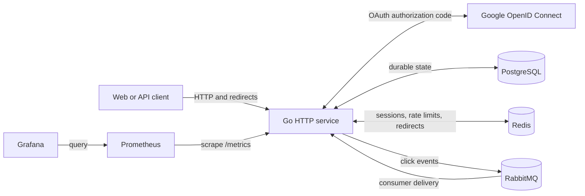
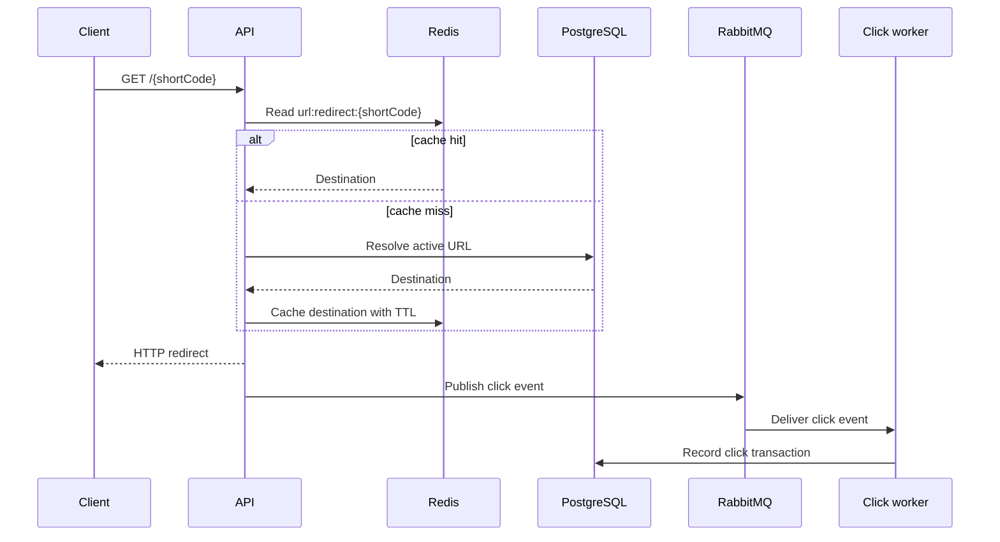

# URL Shortener Design

## Purpose

This document describes the architecture and design decisions of the URL Shortener service. For setup and endpoint details, see [README.md](README.md) and [docs/api.md](docs/api.md).

The system provides authenticated URL management, low-latency public redirects, asynchronous click analytics, multi-provider authentication, session management, administrative controls, and scheduled retention.

## Design goals

- Keep public redirects fast and available.
- Treat PostgreSQL as the durable source of truth.
- Use Redis only for data that can be reconstructed from PostgreSQL.
- Move non-critical click recording away from the redirect response path.
- Keep business rules inside internal services and infrastructure protocols inside external adapters.
- Make authentication state explicit across users, sessions, and JWT claims.
- Support graceful process shutdown and independently testable components.

## System context

The application is deployed as one Go process. Background workers run in the same process and share the configured database, logger, and service layer.

## Code organization

| Location | Responsibility |
| --- | --- |
| `cmd/server` | Composition root, dependency wiring, startup, workers, and shutdown |
| `internal/routes` | HTTP route registration and middleware composition |
| `internal/handler` | HTTP decoding, request context extraction, and response mapping |
| `internal/service` | Authentication, URL, account, admin, analytics, and retention rules |
| `internal/middleware` | Authentication, authorization, request logging, and metrics |
| `internal/db/queries` | Handwritten SQL consumed by sqlc |
| `internal/db/gen` | Generated type-safe query code; never edited manually |
| `internal/db/migrations` | Versioned PostgreSQL schema changes |
| `internal/payload` | Transport request and response models |
| `internal/apperror` | Stable application errors mapped to HTTP status codes |
| `internal/cachekey` | Shared application cache-key namespaces |
| `external/cache` | Generic Redis contract and implementation |
| `external/oauth` | OAuth/OIDC protocol and provider HTTP behavior |
| `external/queue` | RabbitMQ contracts, click events, and implementation |
| `external/logger` | Structured logging abstraction |
| `external/metrics` | Prometheus metric definitions |

Dependencies point inward: handlers depend on service interfaces, services depend on query and infrastructure contracts, and the composition root supplies concrete implementations. External adapters do not own application rules such as authentication provider policy or cache-key meaning.

## Request path

```mermaid
flowchart TD
    Request[HTTP request] --> Logging[Logging and metrics middleware]
    Logging --> Route[Route handler]
    Route -->|protected route| Auth[JWT and session middleware]
    Auth --> Role[Optional role check]
    Role --> Handler[Handler]
    Route -->|public route| Handler
    Handler --> Service[Application service]
    Service --> Query[sqlc query interface]
    Service --> Infrastructure[Cache, queue, or OAuth contract]
    Query --> DB[(PostgreSQL)]
```

Handlers should remain thin. They validate transport-level input, read authenticated values from the request context, call a service, and convert application errors into the standard response envelope.

## URL creation and management

URL creation validates the destination before persistence:

1. Parse and validate the destination URL.
2. Reject blocked domains and blocked client IP ranges.
3. Check destination health.
4. Create or reuse the destination record.
5. Create the short URL and its initial version transactionally.
6. Invalidate or populate redirect cache entries when URL state changes.

PostgreSQL owns URL status, expiration, ownership, version history, and analytics records. Redis never becomes authoritative for URL state.

## Redirect and click flow

RabbitMQ decouples click persistence from redirect latency. If asynchronous publishing is disabled or unavailable, the redirect service can fall back to synchronous click recording. Analytics failure must not invalidate an otherwise valid redirect.

Consumer acknowledgements occur only after click persistence succeeds. Failed processing is returned to the queue implementation so its delivery policy can retry or reject the message.

## Authentication model

The service supports two authentication providers:

- `SYSTEM`: email and local password.
- `GOOGLE`: Google OpenID Connect authorization-code flow.

The `users.has_password` field makes local credential availability explicit. A Google-only user has `has_password = false` and a null password hash; the database constraint prevents contradictory states. OAuth identities are stored separately from users so provider subjects can be linked to local accounts.

Password login uses a generic invalid-credentials error for unknown emails and incorrect passwords. A known OAuth-only account receives a dedicated unauthorized response directing the user to Google. Password-management operations are rejected when no local password exists.

### Google browser flow

1. The login endpoint creates random state and stores it in an HTTP-only cookie.
2. The browser is redirected to the configured Google authorization endpoint.
3. The callback validates state before exchanging the authorization code.
4. The provider adapter retrieves the verified identity.
5. The service resolves, links, or creates the local user and OAuth account transactionally.
6. Normal application access and refresh tokens are issued.
7. HTTP-only cookies are set and the browser is redirected only to `FRONTEND_URL`.

OAuth credentials and provider URLs are runtime configuration. They must never be embedded in source code.

## Tokens and sessions

Access tokens are signed JWTs containing the display user ID, email, display name, role, authentication provider, session ID, and session version. Refresh tokens are random values whose hashes are stored in PostgreSQL.

Every login creates a session containing device metadata, expiry, status, and authentication provider. Session validation uses Redis first and falls back to PostgreSQL on a cache miss. PostgreSQL remains authoritative for revocation and expiry.

The session version is derived from the session activity timestamp. Refreshing a token advances that version, which invalidates access tokens issued against older session state.

Shared cache namespaces are defined in `internal/cachekey`:

- `session:{sessionID}` stores session validation data.
- `ratelimit:{email}` stores failed password-login attempts and lockout state.
- `url:redirect:{shortCode}` stores redirect destinations.

Session cache entries expire no later than their refresh-token lifetime. Revocation and password changes evict affected cache entries immediately.

## Account deletion

Account deletion is a recoverable lifecycle rather than an immediate hard delete:

1. The user confirms deletion while authenticated.
2. The account moves to `PENDING_DELETION` with a grace-period deadline.
3. Other sessions are revoked and evicted; the initiating session is preserved so the user can cancel deletion.
4. Cancellation restores the active account state before the deadline.
5. The retention worker permanently deletes accounts whose grace period has expired.

Database transactions protect state transitions and related session updates.

## Administration and retention

Admin routes require both authentication and the `ADMIN` role. Administrative services manage blocked domains, blocked CIDR ranges, user deletion, manual purges, and audit records.

The retention worker runs once at startup when enabled and then on the configured interval. Each cycle:

1. Purges old revoked or expired sessions.
2. Purges password history beyond the retention period.
3. Processes accounts whose deletion grace period has expired.
4. Writes a system audit entry.

Tasks are attempted independently. One purge failure is logged but does not prevent the remaining tasks from running.

## Data ownership and consistency

| Data | Authoritative store | Secondary mechanism |
| --- | --- | --- |
| Users and OAuth identities | PostgreSQL | None |
| URLs and destinations | PostgreSQL | Redis redirect cache |
| Sessions and refresh-token hashes | PostgreSQL | Redis session cache |
| Login rate limits | Redis | None; temporary protection only |
| Click analytics | PostgreSQL | RabbitMQ delivery buffer |
| Audit logs | PostgreSQL | None |

Transactions are used where multiple durable writes must succeed together. Cache updates are best-effort and happen around durable operations; cache misses reconstruct data from PostgreSQL. This avoids distributed transactions while preserving correctness.

## Failure behavior

- PostgreSQL startup failure prevents the service from becoming ready because durable state is mandatory.
- Redis errors are treated as cache misses where correctness permits; PostgreSQL is the fallback for session and redirect reads.
- RabbitMQ can be disabled. Publish failures use the synchronous click-recording path rather than failing redirects.
- OAuth provider failures return authentication errors without creating partial local accounts.
- Background worker failures are logged and isolated from the HTTP server lifecycle.
- Process shutdown cancels workers, shuts down HTTP serving, and closes infrastructure connections.

## Security boundaries

- Passwords are hashed with bcrypt and are never logged.
- JWTs are HMAC-signed using a required runtime secret.
- Refresh tokens are stored as hashes rather than plaintext.
- OAuth callbacks validate state to prevent login CSRF.
- Authentication cookies are HTTP-only, use `SameSite=Lax`, and become secure cookies for HTTPS URLs.
- Redirect destinations are checked against blocked domains and destination health rules.
- Admin endpoints require explicit role authorization.
- SQL is defined through sqlc queries rather than interpolated strings.
- Error messages avoid distinguishing unknown emails from incorrect passwords.

## Observability

Structured logs carry operation context without exposing credentials. Prometheus exports HTTP and application metrics at `/metrics`, and Grafana consumes Prometheus data for dashboards. Audit logs capture security-sensitive administrative and retention actions separately from operational logs.

## Testing strategy

- Unit tests use interface-backed fakes for services, providers, caches, queues, and generated query contracts.
- Handler tests verify HTTP status, response envelopes, cookies, and request-context behavior.
- Service tests verify business rules, transaction outcomes, cache behavior, and error mapping.
- Infrastructure tests cover Redis, RabbitMQ, OAuth HTTP behavior, configuration, and logging where practical.
- Generated sqlc code is validated by regenerating it in the pre-commit workflow.
- CI runs formatting, static analysis, builds, tests, and security analysis.

## Change rules

- Put OAuth protocol and provider HTTP behavior in `external/oauth`.
- Keep user linking, token issuance, and sessions in internal services.
- Add a migration and regenerate sqlc output when persistent models change.
- Update tests across provider, service, handler, middleware, configuration, and routes when authentication flow changes.
- Keep shared application cache namespaces in `internal/cachekey`, not in the generic Redis adapter.
- Update this document when a change alters a system boundary, authoritative data owner, major flow, or failure policy.
